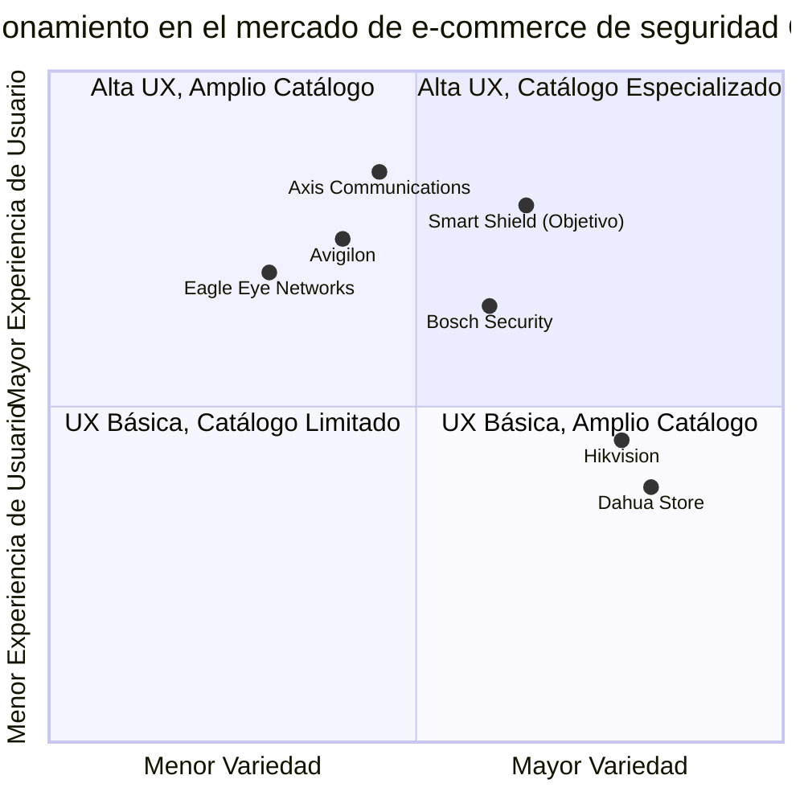

# Documento de Requisitos del Producto (PRD)
## Sitio Web E-Commerce para Smart Shield

Fecha: 20/05/2025

## 1. Información del Proyecto

### 1.1 Descripción General
Smart Shield busca desarrollar un sitio web profesional de comercio electrónico especializado en la venta de equipos CCTV, cámaras de seguridad y servicios de soporte técnico. La plataforma debe proyectar profesionalismo, confiabilidad y experiencia en el sector de seguridad electrónica.

### 1.2 Tecnologías a Utilizar
- **Frontend**: React
- **Backend**: Node.js
- **Base de Datos**: MongoDB

## 2. Definición del Producto

### 2.1 Objetivos del Producto
1. Crear una plataforma de comercio electrónico altamente funcional y segura para la venta de equipos de seguridad CCTV.
2. Establecer una presencia digital profesional que refleje la experiencia y confiabilidad de Smart Shield en el mercado de seguridad electrónica.
3. Brindar una experiencia de usuario optimizada que maximice las conversiones y fomente la fidelidad del cliente.

### 2.2 Historias de Usuario
1. **Como cliente potencial**, quiero poder explorar fácilmente el catálogo de cámaras y equipos de seguridad por categorías, para encontrar rápidamente lo que necesito según mis requisitos específicos.
2. **Como cliente recurrente**, quiero poder crear una cuenta y guardar mis preferencias e historial de compras, para agilizar futuras transacciones y recibir recomendaciones personalizadas.
3. **Como propietario de negocio**, quiero acceder a un asesoramiento especializado sobre los sistemas de seguridad adecuados para mi empresa, para garantizar una inversión eficiente y efectiva.
4. **Como cliente técnico**, quiero poder comparar especificaciones detalladas entre diferentes modelos de cámaras, para tomar decisiones informadas basadas en características precisas.
5. **Como cliente con problemas técnicos**, quiero acceder fácilmente al soporte técnico y recursos de ayuda, para resolver rápidamente cualquier inconveniente con mi equipo de seguridad.

### 2.3 Análisis Competitivo

| Competidor | Fortalezas | Debilidades |
|------------|------------|-------------|
| **Hikvision** | - Amplio catálogo de productos<br>- Marca reconocida globalmente<br>- Precios competitivos | - Interfaz de usuario compleja<br>- Tiempo de carga lento<br>- Soporte técnico limitado |
| **Dahua Store** | - Buena organización por categorías<br>- Detalles técnicos completos<br>- Sistema de búsqueda avanzado | - Diseño visual anticuado<br>- Proceso de compra complicado<br>- Pocas opciones de pago |
| **Axis Communications** | - Diseño premium<br>- Excelente calidad de imagen en demos<br>- Buena sección de recursos | - Precios elevados<br>- Enfoque en segmento profesional<br>- Poca variedad para usuarios domésticos |
| **Bosch Security** | - Alta confiabilidad de marca<br>- Excelente servicio postventa<br>- Soluciones integradas | - Navegación confusa<br>- Pocas opciones de filtrado<br>- Sin visualización de stock en tiempo real |
| **Avigilon** | - Tecnología de IA avanzada<br>- Herramientas de comparación<br>- Recursos educativos | - Enfoque exclusivo en segmento premium<br>- Pocos comentarios de usuarios<br>- Sin opción de chat en vivo |
| **Eagle Eye Networks** | - Soluciones basadas en la nube<br>- Interfaz moderna<br>- Buena experiencia móvil | - Poca variedad de hardware<br>- Enfoque principal en software<br>- Requiere suscripción mensual |

### 2.4 Cuadrante Competitivo



## 3. Especificaciones Técnicas

### 3.1 Análisis de Requisitos

#### 3.1.1 Requisitos Funcionales

**Gestión de Usuarios:**
- RF-01: El sistema DEBE permitir a los usuarios crear cuentas con email y contraseña.
- RF-02: El sistema DEBE implementar autenticación de doble factor para mayor seguridad.
- RF-03: El sistema DEBE permitir recuperación de contraseñas mediante enlace por email.
- RF-04: El sistema DEBE mantener perfiles de usuario con historial de compras y preferencias.
- RF-05: El sistema DEBE proporcionar diferentes niveles de acceso (cliente, administrador, soporte).

**Catálogo de Productos:**
- RF-06: El sistema DEBE organizar productos en categorías y subcategorías lógicas.
- RF-07: El sistema DEBE mostrar imágenes de alta calidad, descripción detallada y especificaciones técnicas.
- RF-08: El sistema DEBE permitir filtrado por múltiples criterios (precio, marca, características).
- RF-09: El sistema DEBE incluir un buscador con autocompletado y corrección ortográfica.
- RF-10: El sistema DEBE ofrecer comparación lado a lado de hasta 4 productos.
- RF-11: El sistema DEBE mostrar productos relacionados y accesorios compatibles.
- RF-12: El sistema DEBE indicar disponibilidad de stock en tiempo real.

**Proceso de Compra:**
- RF-13: El sistema DEBE implementar carrito de compras con persistencia para usuarios registrados.
- RF-14: El sistema DEBE calcular automáticamente costos de envío según ubicación.
- RF-15: El sistema DEBE ofrecer múltiples métodos de pago (tarjeta, PayPal, transferencia).
- RF-16: El sistema DEBE enviar confirmación por email tras cada compra.
- RF-17: El sistema DEBE permitir guardar direcciones y métodos de pago para futuras compras.

**Soporte Técnico:**
- RF-18: El sistema DEBE incluir una sección de preguntas frecuentes categorizada por temas.
- RF-19: El sistema DEBE proporcionar manuales, guías de instalación y videos tutoriales.
- RF-20: El sistema DEBE ofrecer chat en vivo durante horario comercial.
- RF-21: El sistema DEBE incluir un sistema de tickets para seguimiento de problemas técnicos.
- RF-22: El sistema DEBE permitir programar citas para servicio técnico presencial.

**Administración:**
- RF-23: El sistema DEBE incluir un panel de administración para gestión de productos.
- RF-24: El sistema DEBE permitir generar reportes de ventas, inventario y actividad del sitio.
- RF-25: El sistema DEBE facilitar la gestión de promociones y descuentos temporales.
- RF-26: El sistema DEBE automatizar notificaciones de stock bajo.

#### 3.1.2 Requisitos No Funcionales

**Rendimiento:**
- RNF-01: El tiempo de carga inicial DEBE ser inferior a 3 segundos en conexiones estándar.
- RNF-02: El sistema DEBE soportar al menos 1000 usuarios concurrentes sin degradación del servicio.
- RNF-03: Las transacciones de la base de datos DEBEN completarse en menos de 1 segundo.

**Seguridad:**
- RNF-04: El sistema DEBE implementar HTTPS con certificado SSL en todo el sitio.
- RNF-05: Las contraseñas DEBEN almacenarse con encriptación de alta seguridad.
- RNF-06: El sistema DEBE cumplir con los estándares PCI DSS para el procesamiento de pagos.
- RNF-07: El sistema DEBE implementar protección contra ataques comunes (XSS, CSRF, SQL Injection).

**Usabilidad:**
- RNF-08: La interfaz DEBE ser responsiva y funcionar en dispositivos móviles, tablets y ordenadores.
- RNF-09: El sistema DEBE cumplir con las pautas de accesibilidad WCAG 2.1 nivel AA.
- RNF-10: El sistema DEBE tener un diseño consistente y profesional en todas las páginas.

**Disponibilidad y Mantenimiento:**
- RNF-11: El sistema DEBE tener una disponibilidad del 99.9% (downtime máximo de 8.76 horas/año).
- RNF-12: El sistema DEBE realizar copias de seguridad diarias de la base de datos.
- RNF-13: Las actualizaciones de mantenimiento DEBEN realizarse sin interrumpir el servicio.

**Escalabilidad:**
- RNF-14: La arquitectura DEBE permitir escalar horizontalmente para manejar aumentos de tráfico.
- RNF-15: El sistema DEBE estar preparado para crecer al menos un 50% anual en volumen de datos y transacciones.

**Internacionalización:**
- RNF-16: La interfaz DEBERÍA estar disponible en español e inglés inicialmente.
- RNF-17: El sistema DEBERÍA soportar múltiples monedas para transacciones internacionales.

### 3.2 Pool de Requisitos Priorizados

#### P0 (Must Have - Imprescindibles)
- RF-01, RF-03, RF-05: Funcionalidades esenciales de gestión de usuarios
- RF-06, RF-07, RF-09: Elementos básicos del catálogo de productos
- RF-13, RF-15, RF-16: Funcionalidades críticas del proceso de compra
- RF-18, RF-21: Elementos básicos de soporte técnico
- RF-23: Panel de administración básico
- RNF-04, RNF-05, RNF-06: Requisitos de seguridad fundamentales
- RNF-08: Responsividad en todos los dispositivos
- RNF-11, RNF-12: Disponibilidad y respaldo de datos

#### P1 (Should Have - Importantes)
- RF-02, RF-04: Funcionalidades avanzadas de gestión de usuarios
- RF-08, RF-10, RF-12: Funcionalidades mejoradas del catálogo
- RF-14, RF-17: Características adicionales del proceso de compra
- RF-19, RF-20: Elementos avanzados de soporte técnico
- RF-24, RF-25, RF-26: Funciones avanzadas de administración
- RNF-01, RNF-02, RNF-03: Requisitos de rendimiento
- RNF-07, RNF-10: Seguridad y diseño adicionales
- RNF-13, RNF-14: Mantenimiento y escalabilidad básicos

#### P2 (Nice to Have - Deseables)
- RF-11: Recomendación de productos relacionados
- RF-22: Programación de citas para servicio técnico presencial
- RNF-09: Accesibilidad WCAG 2.1 nivel AA
- RNF-15: Escalabilidad avanzada
- RNF-16, RNF-17: Internacionalización y multi-moneda

### 3.3 Diseño UI/UX (Borrador)

#### 3.3.1 Estructura General del Sitio

**Header (Cabecera):**
- Logo de Smart Shield (diseño con cámara de seguridad integrada)
- Menú de navegación principal
- Buscador
- Iconos de acceso a cuenta y carrito
- Indicador de número de productos en carrito

**Footer (Pie de página):**
- Enlaces a información corporativa (Quiénes somos, Contacto, Términos y condiciones)
- Enlaces a redes sociales
- Información de contacto
- Selección de idioma
- Métodos de pago aceptados

**Página de inicio:**
- Banner principal con promociones destacadas
- Categorías principales con imágenes representativas
- Productos destacados/más vendidos
- Sección de novedades
- Llamadas a la acción para servicios de soporte técnico
- Testimonios de clientes

**Página de categoría:**
- Filtros laterales (precio, marca, características)
- Opciones de ordenación (popularidad, precio, novedad)
- Vista en cuadrícula con información básica del producto
- Paginación o carga infinita

**Página de producto:**
- Galería de imágenes con zoom
- Información detallada y especificaciones técnicas en pestañas
- Disponibilidad y tiempo de entrega estimado
- Opciones de configuración (si aplica)
- Botón de añadir al carrito destacado
- Productos relacionados y accesorios compatibles
- Sección de valoraciones y comentarios de clientes

**Carrito de compra:**
- Lista de productos con miniaturas
- Opciones para modificar cantidades o eliminar productos
- Resumen de costos (subtotal, envío, impuestos, total)
- Opciones de cupones de descuento
- Botón de proceder al pago destacado

**Proceso de pago:**
- Diseño por pasos con indicador de progreso
- Formularios claros y concisos
- Múltiples opciones de pago
- Confirmación final con resumen de la compra

**Área de cliente:**
- Dashboard con resumen de actividad
- Historial de pedidos y seguimiento
- Gestión de datos personales y contraseña
- Direcciones guardadas
- Métodos de pago guardados
- Tickets de soporte abiertos

**Sección de soporte técnico:**
- Buscador de FAQ
- Categorías de temas de ayuda
- Biblioteca de recursos (manuales, videos)
- Formulario para crear tickets de soporte
- Chat en vivo (cuando disponible)
- Calendario para programar visitas técnicas

#### 3.3.2 Paleta de Colores y Estilo

**Colores principales:**
- Azul oscuro (#1A3A5F) - Transmite seguridad y profesionalismo
- Gris acero (#5D6D7E) - Representa durabilidad y tecnología
- Blanco (#FFFFFF) - Proporciona claridad y espacio

**Colores de acento:**
- Azul claro (#4A90E2) - Para botones y elementos interactivos
- Rojo (#E74C3C) - Para alertas y elementos importantes
- Verde (#2ECC71) - Para confirmaciones y disponibilidad

**Tipografía:**
- Titulares: Roboto Bold
- Cuerpo de texto: Open Sans Regular
- Tamaños escalados según la jerarquía de información

**Elementos visuales:**
- Iconografía minimalista y consistente
- Sombras sutiles para crear profundidad
- Bordes redondeados en botones y tarjetas (4px)
- Espaciado generoso para mejorar legibilidad

### 3.4 Arquitectura Técnica

#### 3.4.1 Arquitectura del Sistema

**Frontend (React):**
- Componentes reutilizables siguiendo metodología Atomic Design
- Redux para gestión del estado global
- React Router para navegación
- Axios para llamadas a la API
- Styled Components para estilos
- Jest y React Testing Library para pruebas unitarias

**Backend (Node.js):**
- Express.js como framework
- JWT para autenticación
- Middlewares de seguridad (helmet, cors, rate-limiting)
- Estructura modular siguiendo principios MVC
- Validación de datos con Joi
- Swagger para documentación de API

**Base de Datos (MongoDB):**
- Colecciones principales: Users, Products, Categories, Orders, Support_Tickets
- Índices optimizados para consultas frecuentes
- Implementación de TTL para sesiones
- Esquemas validados con Mongoose

**Integración con servicios externos:**
- Pasarelas de pago (Stripe, PayPal)
- Servicio de email (SendGrid)
- CDN para imágenes y contenido estático
- Analítica (Google Analytics)

#### 3.4.2 Requisitos de Infraestructura

**Entorno de producción:**
- Servidor web de alto rendimiento (Nginx)
- Servidor de aplicaciones Node.js
- Base de datos MongoDB con replicación
- CDN para assets estáticos
- Certificado SSL
- Firewall y protección DDoS

**Entorno de desarrollo:**
- Configuración Docker para desarrollo local
- Entorno CI/CD para integración y despliegue continuo
- Entorno de staging para pruebas previas a producción

#### 3.4.3 Modelo de Datos

**Colección Users:**
```javascript
{
  _id: ObjectId,
  email: String,
  password: String (hashed),
  name: String,
  lastName: String,
  phone: String,
  role: String (enum: ['customer', 'admin', 'support']),
  addresses: [{
    type: String,
    street: String,
    city: String,
    state: String,
    zipCode: String,
    country: String,
    isDefault: Boolean
  }],
  paymentMethods: [{
    type: String,
    lastFour: String,
    expiryDate: Date,
    isDefault: Boolean
  }],
  createdAt: Date,
  updatedAt: Date
}
```

**Colección Products:**
```javascript
{
  _id: ObjectId,
  name: String,
  slug: String,
  description: String,
  shortDescription: String,
  price: Number,
  discount: Number,
  stock: Number,
  sku: String,
  brand: String,
  category: ObjectId (ref: Categories),
  subcategory: ObjectId (ref: Categories),
  images: [String],
  specifications: [{
    key: String,
    value: String
  }],
  features: [String],
  relatedProducts: [ObjectId],
  compatibleAccessories: [ObjectId],
  ratings: {
    average: Number,
    count: Number
  },
  createdAt: Date,
  updatedAt: Date
}
```

**Colección Categories:**
```javascript
{
  _id: ObjectId,
  name: String,
  slug: String,
  description: String,
  image: String,
  parent: ObjectId (ref: Categories),
  isActive: Boolean,
  order: Number,
  createdAt: Date,
  updatedAt: Date
}
```

**Colección Orders:**
```javascript
{
  _id: ObjectId,
  user: ObjectId (ref: Users),
  orderNumber: String,
  items: [{
    product: ObjectId (ref: Products),
    quantity: Number,
    price: Number,
    name: String
  }],
  shipping: {
    address: {
      street: String,
      city: String,
      state: String,
      zipCode: String,
      country: String
    },
    method: String,
    cost: Number,
    trackingCode: String
  },
  payment: {
    method: String,
    transactionId: String,
    status: String
  },
  subtotal: Number,
  tax: Number,
  total: Number,
  status: String (enum: ['pending', 'paid', 'processing', 'shipped', 'delivered', 'cancelled']),
  notes: String,
  createdAt: Date,
  updatedAt: Date
}
```

**Colección Support_Tickets:**
```javascript
{
  _id: ObjectId,
  ticketNumber: String,
  user: ObjectId (ref: Users),
  subject: String,
  description: String,
  category: String,
  priority: String (enum: ['low', 'medium', 'high']),
  status: String (enum: ['open', 'in-progress', 'waiting-user', 'resolved', 'closed']),
  assignedTo: ObjectId (ref: Users),
  messages: [{
    sender: ObjectId (ref: Users),
    content: String,
    attachments: [String],
    timestamp: Date
  }],
  relatedOrder: ObjectId (ref: Orders),
  relatedProduct: ObjectId (ref: Products),
  createdAt: Date,
  updatedAt: Date,
  resolvedAt: Date
}
```

### 3.5 Preguntas Abiertas

1. **Alcance Geográfico**: ¿La tienda operará solo a nivel nacional o también contemplará envíos internacionales? Esto afectará el cálculo de impuestos, envíos y la necesidad de internacionalización.

2. **Integración con Sistemas Existentes**: ¿Existe algún sistema de gestión de inventario, CRM o ERP con el que la plataforma deba integrarse?

3. **Estrategia de Contenido**: ¿Se debe incluir un blog o sección de recursos educativos para mejorar SEO y posicionamiento como expertos?

4. **Métricas de Éxito**: ¿Cuáles son los KPIs específicos que el cliente utilizará para medir el éxito de la plataforma?

5. **Modelo de Soporte**: ¿El soporte técnico será gestionado internamente o se utilizará un sistema de terceros?

6. **Requisitos Legales Específicos**: ¿Existen requisitos regulatorios específicos para la venta de equipos de seguridad que deban considerarse?

7. **Estrategia de Escalabilidad**: ¿Cuáles son las expectativas de crecimiento en términos de catálogo de productos y volumen de ventas para los próximos 1-3 años?

## 4. Plan de Implementación

### 4.1 Fases de Desarrollo

#### Fase 1: Planificación y Diseño (3 semanas)
- Definición detallada de requisitos
- Diseño de arquitectura del sistema
- Diseño de UI/UX completo
- Creación de prototipos interactivos
- Aprobación de diseños y arquitectura

#### Fase 2: Desarrollo Base (6 semanas)
- Configuración del entorno de desarrollo
- Implementación de la estructura base del frontend
- Desarrollo del backend y API RESTful
- Configuración de la base de datos MongoDB
- Implementación del sistema de autenticación

#### Fase 3: Funcionalidades Principales (8 semanas)
- Desarrollo del catálogo de productos
- Implementación del carrito de compra
- Desarrollo del proceso de checkout
- Integración con pasarelas de pago
- Implementación del panel de administración básico

#### Fase 4: Funcionalidades Secundarias (4 semanas)
- Desarrollo del sistema de soporte técnico
- Implementación de búsqueda avanzada
- Desarrollo del sistema de valoraciones y comentarios
- Implementación de recomendaciones personalizadas

#### Fase 5: Pruebas y Optimización (3 semanas)
- Pruebas unitarias y de integración
- Pruebas de carga y rendimiento
- Optimización de rendimiento
- Pruebas de seguridad
- Corrección de errores

#### Fase 6: Despliegue y Lanzamiento (2 semanas)
- Configuración del entorno de producción
- Migración inicial de datos
- Pruebas finales en entorno de producción
- Lanzamiento gradual
- Monitoreo post-lanzamiento

### 4.2 Hitos y Entregables

- **Semana 3**: Aprobación de diseño y arquitectura
- **Semana 9**: Demostración del MVP con funcionalidades básicas
- **Semana 17**: Revisión de todas las funcionalidades principales
- **Semana 21**: Pruebas de aceptación de usuario
- **Semana 24**: Capacitación del equipo administrativo
- **Semana 26**: Lanzamiento oficial

### 4.3 Recursos Necesarios

**Equipo de Desarrollo:**
- 1 Project Manager
- 2 Desarrolladores Frontend (React)
- 2 Desarrolladores Backend (Node.js/MongoDB)
- 1 Diseñador UI/UX
- 1 QA Engineer
- 1 DevOps Engineer (tiempo parcial)

**Infraestructura:**
- Entorno de desarrollo y pruebas
- Entorno de staging
- Entorno de producción
- Servicios de CDN
- Servicio de correo electrónico
- Servicios de pasarela de pago

## 5. Conclusión

El sitio web de comercio electrónico para Smart Shield será una plataforma completa y profesional diseñada específicamente para la venta de equipos CCTV y cámaras de seguridad. Con un enfoque en la experiencia de usuario, la seguridad y la escalabilidad, el sitio no solo servirá como canal de ventas sino también como herramienta para establecer a Smart Shield como referente en el sector de seguridad electrónica.

La implementación de tecnologías modernas como React para el frontend y MongoDB para la base de datos garantizará un rendimiento óptimo, mientras que el diseño centrado en el usuario facilitará la navegación y el proceso de compra, maximizando así las conversiones y la satisfacción del cliente.

Con este plan de desarrollo estructurado, Smart Shield tendrá una plataforma digital robusta que respaldará su crecimiento y objetivos comerciales a largo plazo.